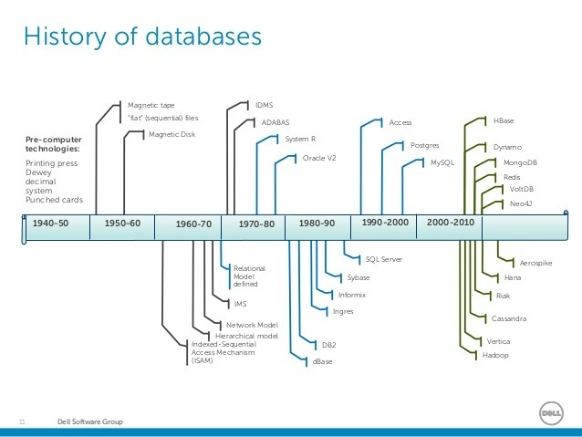
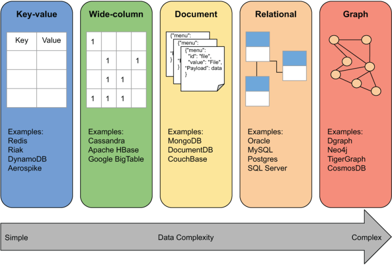

# 从数据库历史和分类说起，一文了解图数据库的过去和未来

欢迎来到“人人都能学会图数据库”（Graphs4Everyone）系列课程。今天我们一起从数据库的基础知识讲起，来回顾数据库历史，并了解图数据库这个特殊分类的过去和未来。

## 数据库是软件系统的基础设施

每一个想进入软件行业或对开发工作感兴趣的人，都需要了解和熟练掌握数据库的使用和开发。数据库是企业软件最大的基础设施，所以数据库在计算机科学和软件行业里非常重要。因此，人人都需要掌握数据库。

我们常说的“**数据库**”，其实包含两部分：

1. 表示<u>一组相关数据及其组织方式</u>的“数据库”。
2. <u>对数据进行访问和管理</u>的“数据库管理系统”（DBMS：Database Management System）。

数据库，数据库管理系统和相关的应用程序的总和，可以称为数据库系统，或者我们经常直接简称为：**数据库** 🤪 ，甚至有时候我们用数据库来指代我们的Excel文件呢。所以谈论数据库的时候，在你心里要知道它是由好几部分组成的。

另外，数据库和DBMS都符合特定的数据库模型，数据库模型是确定数据库逻辑结构的规范和准则，它从根本上确定了数据的存储、组织和操作的方式。*你知道最流行的数据库模型是什么吗？*

数据库都提供了增删改查（CRUD：Create, Read, Update, Delete）的操作，是不是耳熟能详的词来了？其实这样说还不够严谨，可以按照这样来划分：

1. 数据定义：创建、修改和删除定义数据组织方式的定义，或者叫做“模式”（Schema）。
2. 更新：插入、修改和删除实际的数据。
3. 检索：就是读取数据，通过直接可用的形式提供数据或供其他应用程序进一步处理。
4. 管理：对数据库的用户、行为、性能等进行注册和监控，提供数据安全、维护数据完整性、处理并发、灾难恢复等一系列功能。

这样就更容易对数据库和数据库管理系统及相关应用程序有一个整体的认识了。

## 数据库的历史

数据库是伴随着操作系统的出现（那是1980年代前），软件系统在各行业的大规模应用，需要处理的数据的数量和复杂程度迅速膨胀，而逐渐产生了数据库系统。得益于处理器CPU、内存RAM、存储和网络的技术进步，数据库系统的各项分支也在以数量级的方式增长。

一般将数据库技术的发展根据数据模型或结构划分为3个时代：**导航**、**关系数据库RDBMS**和**NoSQL**。

### 导航数据库

顾名思义，导航（Navigational）数据库依赖于磁盘存储介质的功能，数据记录使用指针或引用来跟踪，根据资料记载，出现了分层数据模型和网络数据模型。

哦对了，那是1960年代的事情了。这期间陆续诞生了很多伟大的产品。

### 关系数据库

在软件行业，不满足于现状，通常会产生下一个软件。还有，增加一层抽象，通常会创造出更好的系统。关系数据库就是这样一种新的数据库构建方法。那是1970年代。指针和引用虽好，但缺少“搜索”，磁盘地址虽然好理解，但太依赖磁盘技术了。

所以，我们现在大量使用的数据库模型，就这样诞生了，而且沿用至今甚至未来。

### NoSQL(Not only SQL)

时间来到2000千禧之年，随着Web2.0时代的到来，数据量和规模的大量增长，软件开发人员开始对固定的表模式感到乏力和厌倦，他们开始直接把“原始”数据放入数据库了！

这些数据库系统有着更简单的设计、更好地控制可用性、更容易地水平扩展到集群等等特点。最大的一个特点是NoSQL使用了跟关系数据库不同的数据库模型，包含键值对（Key-Value）、宽列、文档和图（Graph）等。NoSQL中的一些操作比关系数据库更快，所以有着非常广泛的应用。

### 一个简单的列表

我们一起看一下几个关键的时间和出现的事物。

1962年：“数据库（Database）”一词开始流行于系统研发公司的备忘录中。

1970年：IBM的Edgar Frank Codd撰写了“大型共享数据库的关系模型”的论文，以此被称为“关系数据库之父“。

1979年：Oracle创建了第一个商业关系型数据库管理系统（RDBMS）。

1983年：IBM发布DB2。

1984年：Teradata发布第一个大规模并行处理（MPP）数据库平台。

1985年：适用于PC桌面的数据库系统出现，比如微软Access。

1988年：IBM首次提出“数据仓库”一词及行业标准。

1995年：第一款开源关系型数据库管理系统MySQL发布。

2000年：Neo4j的创始团队在RDBMS上遇到了性能问题，并开始构建第一个Neo4j原型。

2003年：第一款XML数据库发布，标志着进入NoSQL阶段。

2007年：第一款商用图数据库Neo4j发布，同期发布了开源版本。

2009年：商用大数据Hadoop平台Cloudera的产品发布。同期由MongoDB引发了去SQL的浪潮。

2010年：Neo4j图数据库发布1.0正式版。

2011年：基于资源描述框架（RDF）的图数据库管理系统开始浮现。

2014年：Apache Spark发布。

2015年：Apache发布超过25个数据相关项目。

2016年：Neo4j图数据库发布3.0正式版。

## 图数据库的发展

上面的历史列表中，我嵌入了图数据库Neo4j的一些关键事件，也可以[从Neo4j官网了解发展历程](https://neo4j.com/company/)。

在这里从一个更普遍和广泛的视角来看一下图数据库的起源。

### 图数据库的定义

图数据库也是一种数据库系统，属于NoSQL，图数据库优先考虑数据之间的关系，使用图数据结构（Graph）来表示数据，包含节点（Vertex, Node）和边（Edge, Relationship）以及属性（Property），边表示节点之间的关联关系。

‼️**重点**：边是图数据库中的关键概念。用来表示没有在关系数据模型或文档数据模型等里面直接实现的抽象。

为什么要这么做呢？因为图无处不在。现实世界中和我们要处理的大量数据是相互关联的，虽然这些数据的关联结构对于我们不常见，但我们其实一直在使用关联关系来解决各种问题。比如：找到两点之间最短路径、优化物流配送网络、社交网络影响力分析、疫情传播分析、构建知识图谱等等场景，使用图数据库来解决这些问题是最有效的方案。

> 这里需要介绍一个定义：图问题（Graph Problem），你知道什么样的问题属于图问题吗？

### 图数据库的历史

图数据库的起源也很早，早在导航数据库的年代就出现了树状数据模型（树也是图的一种哦！），网络数据模型也算是一种图结构。

在1990年代出现了对图数据库的改进，加速了网页数据的索引，网页数据包含大量链接，可以看作网页之间的关联关系，使用图数据库就很自然地能表示这些数据。

2000年的时候，具备ACID的商用图数据库发布，没错就是Neo4j，这样就可以使用图数据库来解决交易系统（OLTP）的数据问题了。

随着产品的改进，图数据库目前也大量使用于分析系统（OLAP），同样，随着数据量和复杂程度的增长，越来越多的场景开始使用图数据库来处理复杂数据结构。

我最近在阅读[《图数据库实战》][3]这本书，第一章里有这个对比图。可以看到从不同的数据复杂程度，数据库系统可以分为以下5种类别，图数据库在处理关联数据方面有着明显优势。

2006年，Tim Bernes-Lee构思了一个叫[Linked-Data](https://www.w3.org/DesignIssues/LinkedData.html)的庞大数据库，使用了[RDF](https://www.w3.org/TR/rdf11-concepts/)格式来存储网站之间的关联关系，节点表示网站，边表示网站链接，这样构成了一个图，[Schema.org](https://schema.org/)和[Google结构化数据](https://developers.google.com/search/docs/advanced/structured-data/intro-structured-data)都支持这样的数据。

2007年，[DBpedia](https://wiki.dbpedia.org/)发布，它允许用户从语义上查询维基百科的资源，包括指向相关数据的链接。这成为当时最大的图数据库应用。Neo4j在这一年发布了商用版本哦！同时开源了社区版本。

在2010年，Google发布了搜索的关联信息展示，即知识图谱，这使得图数据库的应用成为主流，极大地改善了搜索体验，因为它提供了额外的上下文信息和关联的信息，帮助用户更有效的找到想要的信息。

2013年，Facebook推出了Graph Search，基于Facebook的社交图谱，这个图数据库系统非常强大，强大到暴露了很多不应该出现的问题。

2014年，Crunchbase推出[基于Neo4j的新平台](https://neo4j.com/blog/congratulations-crunchbase/)，为用户提供关于连接关系的公司图谱。

2016年，微软收购LinkedIn，推出了包含6亿专业人士的[经济图谱](https://economicgraph.linkedin.com/)，再次证明了图技术的实力。

2017年，一些较大的组织和企业开始采用图技术，汤森路透公布了一个[知识图谱](https://developers.refinitiv.com/tr-knowledge-graph/tr-knowledge-graph-feed-api-beta/learning?content=48179&type=learning_material_item)，为金融服务提供基于图数据库的解决方案。

随着数据科学和机器学习ML，人工智能AI的大量应用，图数据因为具备天生的可解释性，也逐渐进入主流应用。2019年Neo4j发布了专用的GDS库，提供了几十种图算法用于图数据的分析。

另一方面，从[DB-Engines][4]对市场上数据库系统的统计数据来看，关系型数据库一直稳定占据大部分市场，而图数据库则是过去10年增长最快的数据库类型。

## 展望图数据库及相关技术的未来

在2021年[CSDN 1024程序员节](https://1024.csdn.net)上，Neo4j创始人兼CEO Emil Eifrem在圆桌论坛“[六大国际数据库掌门人尖峰对话](https://live.csdn.net/v/180165)”上，分享了[图数据平台引领数据库未来十年发展](https://blog.csdn.net/Jennifer726/article/details/121123696)的观点。

> 过去两年，数据库行业的发展趋势呈现三大特征。
>
> 首先是融合，随着新型数据的大规模创新，高速扩展的数据库市场再次呈现出融合的局面，数百家数据库厂商逐渐归入到包括文档数据库、图数据库、时序数据库、NewSQL数据库在内的四个全新且稳定的数据库阵营中。在不同细分领域中，仅有有限的几家公司在领军之路上引吭高歌，如图领域的Neo4j 和文档领域的 MongoDB。
>
> 第二，向云转移成为整个行业的长期趋势。2017年前后一些大型云供应商和独立云供应商开始涌现。虽然曾因数据重力和监管等因素的影响进展放缓，而今这一趋势再次气势如虹。数据向云服务转移在很大程度上成为数据库平台的发展驱动要素。
>
> 第三，数据科学家方兴未艾。整体而言，数据科学家并不喜欢数据库，他们更加钟爱数据。而图数据库是个例外，越来越多的数据科学家对图数据库青睐有加。数据科学家使用图形算法处理数据，再通过图将数据输入机器学习管道中，从而为机器学习模型和预测提供关系型信号。由此，图数据库成为机器学习管道中的核心部分。
>

因此，现在就是最佳的时机开始学习图数据库。

## 资源推荐

- [Neo4j 技能树](https://bbs.csdn.net/skill/neo4j)：人人都能学会图数据库的学习路径，帮助你从0基础掌握Neo4j。
- [成为 Neo4j 认证专家](https://neo4j.com/graphacademy/neo4j-certification/?ref=shiny-csdn-skilltreeblog2)：已有多人通过了Neo4j认证专家的考试。下一个是你吗？

[2]: https://livebook.manning.com/book/graph-databases-in-action/chapter-1/ "Graph Databases in Action Chapter 1"
[3]: https://book.douban.com/subject/35634944/ "豆瓣读书：图数据库实战"
[4]: https://db-engines.com/en/ranking_categories "DBMS popularity broken down by database model "
[5]: https://www.compile.com/blog/insights/brief-history-of-graphs/
