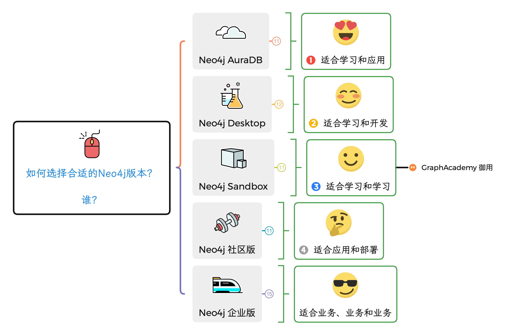
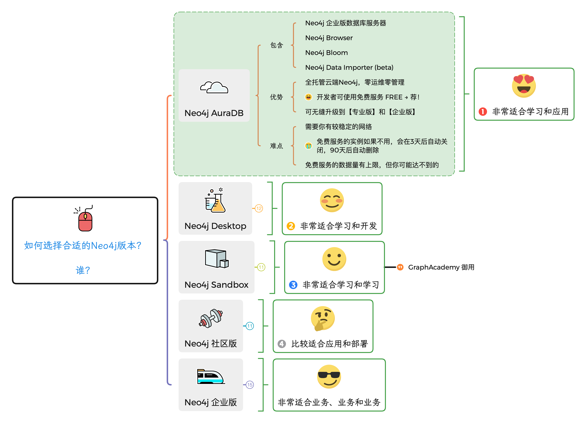
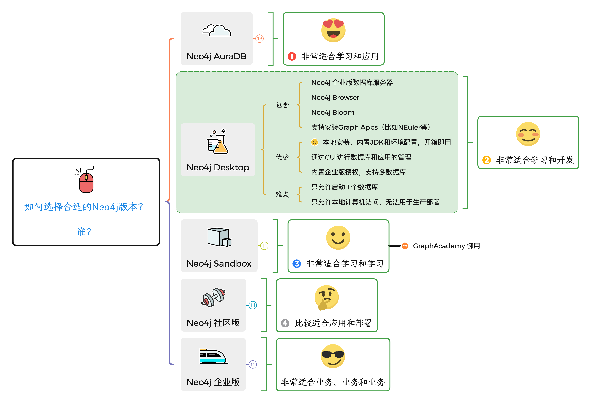
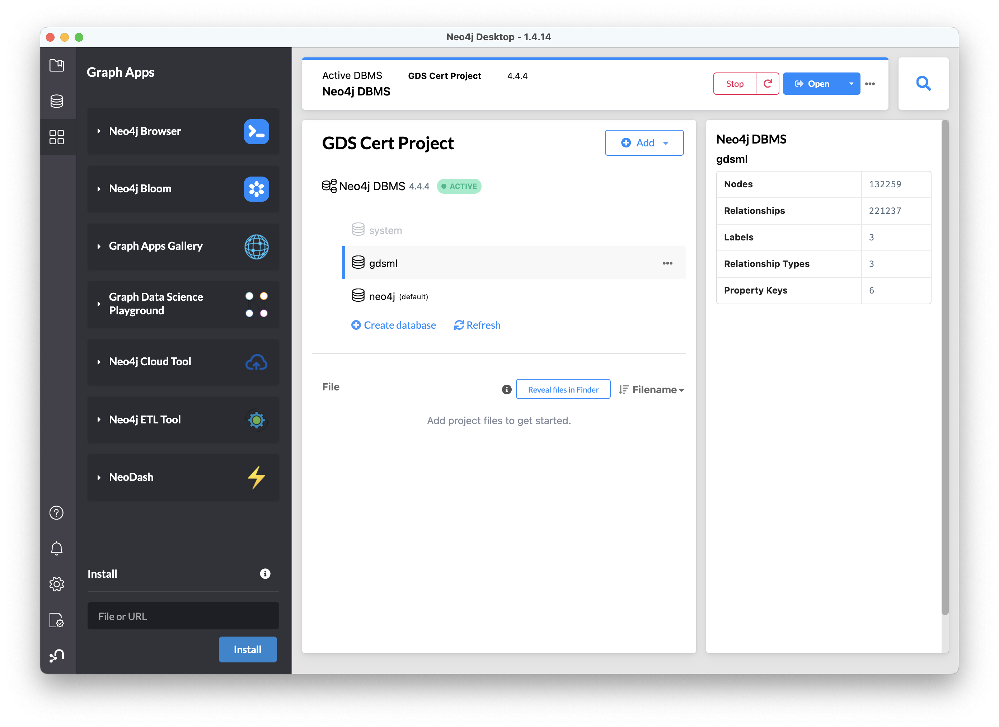
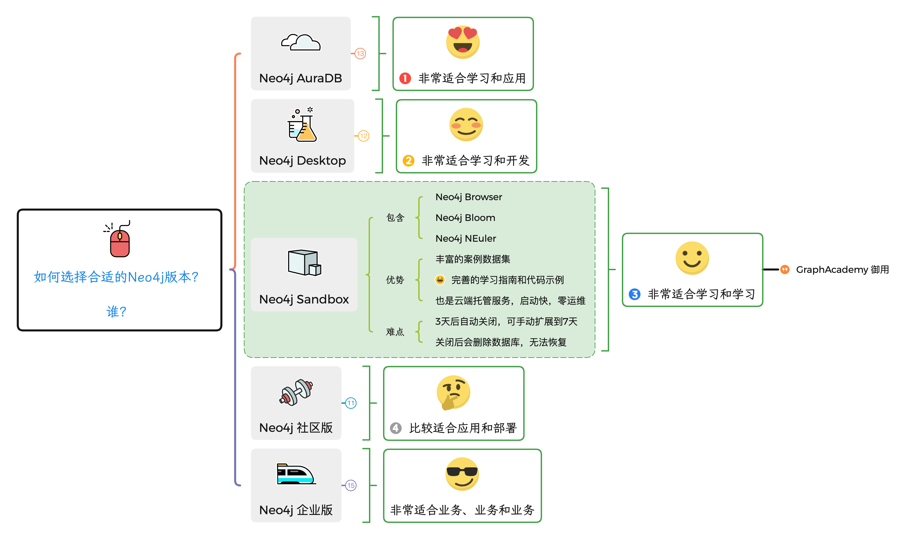
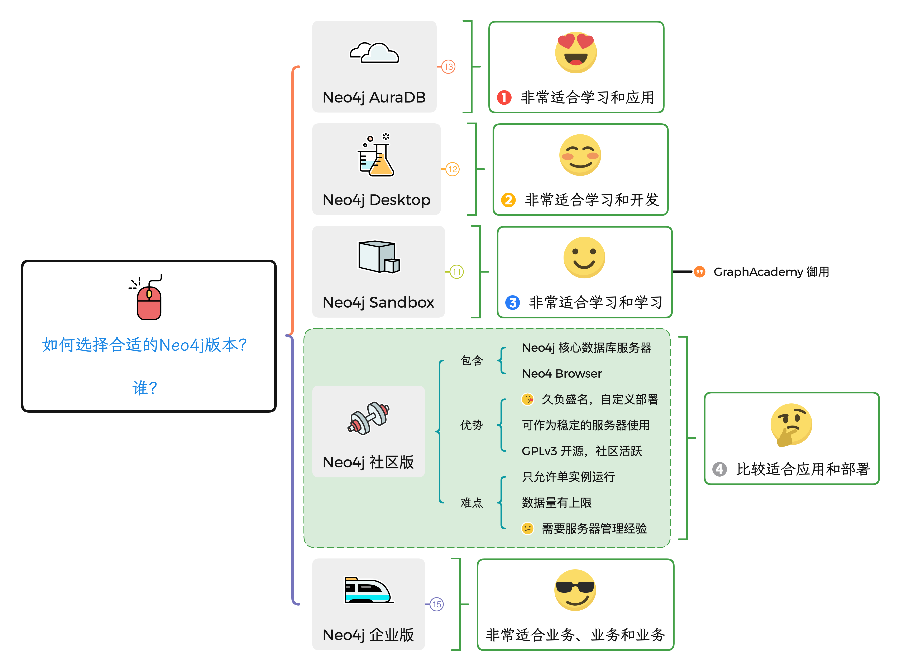
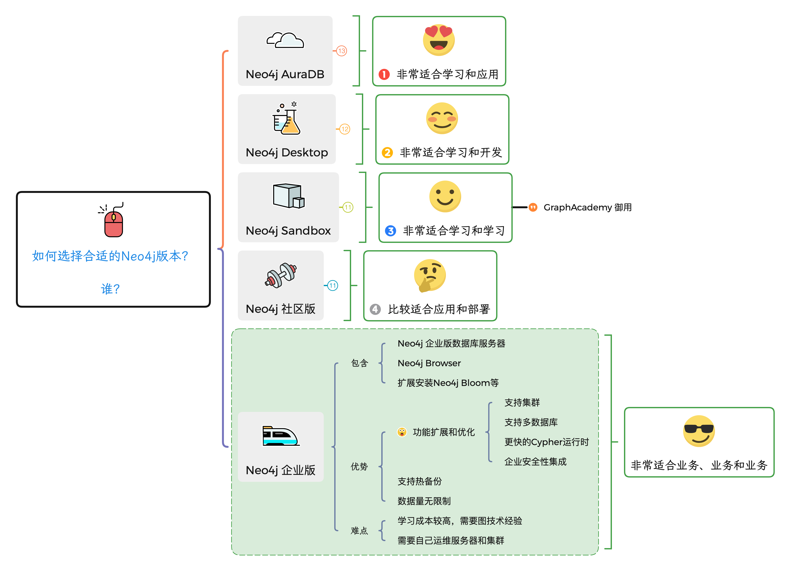

# 如何选择合适的 Neo4j 版本

欢迎来到“人人都能学会图数据库”（Graphs4Everyone）系列课程。

今天我们一起看看如何选择合适自己的 Neo4j 版本来开始图技术旅程。

## 我是谁？

本系列课程的目标读者是初学者和爱好者，希望通过学习一些新技术来丰富自己的技能树。你可以是数据库领域的从业者，希望学习一种新的数据库技术。你可以是刚入门程序开发的新手，发现了这门奇怪的图技术课程。你可以是非程序员行业的人，偶然发现这些图看起来挺炫酷的，想知道怎么做的。等等等等。

你也可以是有过不少经验的图数据库用户，那么也欢迎来回顾一下Neo4j图数据平台提供的一些选择。

总之，在给出如何选择合适的 Neo4j 版本之前，我们要问自己”我是谁？我在哪？”这样的问题。

这篇文章里，我们假设有两个人在等着我推荐：**初学者“小C”**和**老手“大V”**。

来看看我的推荐吧。

## Neo4j 版本全貌

这里所说的“版本”，也可以称为不同的平台、分发版，或者产品。我为了简单易懂，都称做版本了。

大家耳熟能详的可能是开源社区版（Neo4j Community Edition）和企业版（Neo4j Enterprise Edition)了，这是其他分发版或产品的核心，也是长久以来的分发版。我们大量用户和客户都是直接使用这两个版本。

除此之外，Neo4j也提供了不同的产品来给不同的用户和开发者。我们先看图：

Neo4j AuraDB是今年刚正式推出的云端全托管零运维的Neo4j数据平台服务，AuraDB也分为免费版、专业版和企业版3个不同的细分产品。Neo4j Desktop是一个需要下载到你电脑里本地安装的程序包。Neo4j Sandbox是一个基于数据集提供的云端数据库服务。

## TL;DR, 直接告诉我用什么吧！

### Neo4j AuraDB

→ 当然是 Neo4j AuraDB，注册链接在这里：[https://neo4j.com/cloud/aura/](https://neo4j.com/cloud/aura/?ref=shiny-graphs4everyone-dist)

我会对小C说：Neo4j AuraDB Free非常适合初学者上手，注册好就可以用了，不需要自己维护数据库服务器，直接开始学习核心的Neo4j图技术。

我对大V说什么呢？//参考优势第3条。

## 还有其他选择吗？

当然，既然来都来了，我们依次看一下。

### Neo4j Desktop

Neo4j Desktop是我一直打开的程序，因为，它还可以连接到Neo4j AuraDB的数据库！

这是我的截图，可以看到它也支持安装图应用，企业版的Neo4j Bloom也是可以直接用于本地数据库的，哦，Neo4j Desktop的核心数据库就是企业版哦。但同时只能使用1个实例。所以它的场景是用于【学习】和【开发】。

点这里（[https://neo4j.com/download/](https://neo4j.com/download/?ref=shiny-graphs4everyone-dist)）就可以下载Neo4j Desktop，注意它是需要授权的哦，但可以完全免费获取。

### Neo4j Sandbox

沙箱，顾名思义是一个玩耍的地方，所以沙箱默认是从数据项目开始，需要你选择一个用于学习的数据集，然后就可以开始玩数据了。

[Neo4j GraphAcademy](https://graphacademy.neo4j.com/?ref=)是在线免费学习和练手的平台，就是使用Sandbox来承载课程的后台数据库和练习数据集。学完就可以顺便考一个[Neo4j认证专家](https://graphacademy.neo4j.com/courses/neo4j-certification/)的证书了，何乐而不为呢？

### Neo4j 社区版

话说这个是发行最久和使用最多的版本，因为你可以通过操作系统直接安装社区版，我是说Linux下，而且开源社区的参与都是在这个版本上进行。

但是对于小C来说，配置JDK和`neo4j.conf`还是比较复杂的，还是不要过早推荐给TA。

### Neo4j 企业版

Neo4j 企业版也是基于开源社区版的产品，但是多了一系列用于生产环境的功能，还有强大的技术支持（购买之后）。大V已经在他们公司多个核心业务上部署了Neo4j企业版，如有购买意向的现在联系我吧。

## 我要怎么选？

看到这里的应该都是铁粉了，来击个掌！

具体要选择什么版本的产品，问自己两个问题：

1. 我的图技术水平如何？
2. 我会用在什么场景？

然后看看上面的内容就不难决定了。

对吧？

如果还有进一步的疑问和问题，欢迎联系我，或到我们合作的社区提问，我会找到你的。